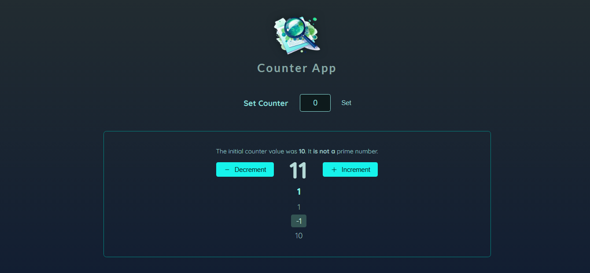

<div id="top"></div>

[](https://react.dev/)


<!-- PROJECT LOGO -->
<br />
<div align="center">
  <a href="https://optimized-counter-app.web.app/">
    
  </a>
  <h1 align="center">Optimized-Counter-App</h1>

  <p align="center">
    <a href="https://optimized-counter-app.web.app/">View Demo</a>
    ·
    <a href="https://github.com/SalahShallapy/Optimized-Counter-App/issues">Report Bug</a>
  </p>
</div>

A React-based counter application designed with performance in mind, utilizing `million.js` for enhanced rendering. Features include configurable initial counters, real-time prime number checks, and historical change tracking.

## Project Overview~

### overview



## Features

- Configurable Counter: Set the initial counter value dynamically.
- Performance Optimization: Uses `million.js` for virtual DOM optimizations.
- Prime Number Validation: Detects if the initial count is a prime number.
- Change History: Tracks all changes made to the counter with clickable history items.
- Interactive UI: Increment, decrement, and reset counters seamlessly.

## How It Works

1. Dynamic Counter Configuration:

   - Users can configure the counter's starting value through the `ConfigureCounter` component.
   - This value is then passed to the Counter component via state lifting.

2. Counter Logic:

   - The Counter component tracks changes using an array of counter adjustments rather than a single value.
   - Each increment or decrement is stored as a separate entry, allowing for detailed history tracking.
   - Prime number checking is optimized using `useMemo` to prevent redundant calculations.

3. History Tracking:

   - The CounterHistory component displays a list of all counter changes.
   - Each history item is interactive, and clicking an item toggles its selection state.

4. Component Rendering Optimization:

   - React.memo ensures unnecessary re-renders are avoided for components like Counter.
   - `useCallback` and `useMemo` are used extensively to optimize functions and derived state.

5. Million.js Integration:
   - `Million.js` is used for virtual DOM optimizations, significantly boosting performance when updating the DOM.
   - This ensures a smoother user experience, even for more complex operations.

## Key Highlights

1. Million.js Integration:

- Optimized rendering and minimized re-renders with advanced reconciliation techniques.

2. React Hooks:

- State management using `useState`, `useMemo`, and `useCallback.`

## Project Structure

```
Optimized-Counter-App
│      .gitignore
│      .vite.config
│      index.html
│      package-lock.json
│      package.json
│      README.md
│
│
└───public
│   logo.png
│   overview.png
│
└─── .million
│   store.json
│
└───src
    │   App.jsx
    │   index.jsx
    │   index.css
    │   log.js
    │
    ├───assets
    │     logo.jpg
    │
    ├───components
    │    │   Header.jsx
    │    │
    │    └─── Counter
    │    │     ConfigureCounter.jsx
    │    │     Counter.jsx
    │    │     CounterHistory.jsx
    │    │     CounterOutput.jsx
    │    │
    │    └─── UI
    │        │  IconButton.jsx
    │        │
    │        └─── Icons
    │              ArrowRightIcon.jsx
    │              MinusIcon.jsx
    │              PlusIcon.jsx
    │
```

## Installation

To get started with the project locally:

1. Clone the repository:
   ```bash
   git clone https://github.com/SalahShallapy/Optimized-Counter-App.git
   ```
2. Navigate to the project directory:
   ```bash
   cd Optimized-Counter-App
   ```
3. Install dependencies:
   ```bash
   npm install
   ```
4. Run the project:

   ```bash
   npm run dev
   ```

## Contributing

Contributions are what make the open source community such an amazing place to learn, inspire, and create. Any contributions you make are **greatly appreciated**.

If you have a suggestion that would make this better, please fork the repo and create a pull request. You can also simply open an issue with the tag "enhancement".
Don't forget to give the project a star! Thanks!

1.  Fork the Project
2.  Create your Feature Branch (`git checkout -b feature/AmazingFeature`)
3.  Commit your Changes (`git commit -m 'Add some AmazingFeature'`)
4.  Push to the Branch (`git push origin feature/AmazingFeature`)
5.  Open a Pull Request

   <p align="right">(<a href="#top">back to top</a>)</p>
